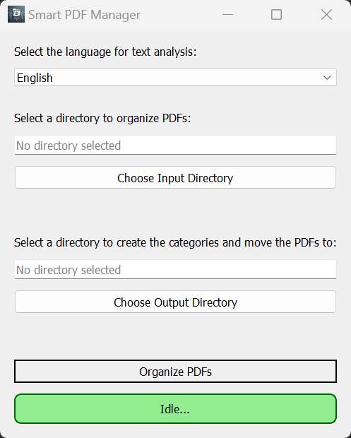

# SmartPDFManager

**Smart PDF Manager** is a Python-based tool designed to automate the organization of PDF files. It leverages **SpaCy**, a powerful natural language processing (NLP) library, to analyze the contents of PDF files and classify them into categories based on extracted entities such as organizations, people, locations, and more. By using SpaCy's entity recognition models, the tool can intelligently categorize PDFs written in English, German, and French, making it highly versatile for multilingual document management.

## Features

- **Organize PDFs**: Classify and move PDFs into directories based on the most common entity (e.g., Organization, Person) found in the document.
- **Supports English, German and French**: Detects entities in English, German and French, improving classification for multilingual documents.

<p align="center">
   
</p>

## Installation (Only if you don't use the executable)

1. Clone this repository:
   ```bash
   git clone https://github.com/Dagait/SmartPDFManager.git
   cd SmartPDFManager
   ```

2. Install the required dependencies:
   ```bash
    pip install -r requirements.txt
    ```
   
3. Install the SpaCy models for English, German and French:
   ```bash
   py -m spacy download en_core_web_sm
   py -m spacy download de_core_news_sm
   py -m spacy download fr_core_news_sm
   ```
   
## Usage (Only if you don't use the executable)

1. Run the application:
   ```bash
   py -m smart_pdf_manager.ui.smart_pdf_manager_app
   ```
2. Select a language for entity recognition (English, German, or French).
3. Place the PDF files you want to organize in a directory of your choice (e.g., `pdfs/`).
4. Choose a directory "input" where the PDFs are located and a directory "output" where the PDFs will be moved to.
5. Start the process by clicking on the "Organize PDFs" button.


## Planned Features

- **Customizable**: Add or adjust categories and keywords to tailor the classification logic to your needs.
